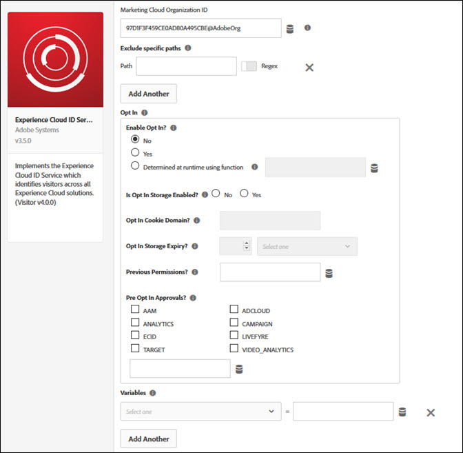

# Konfigurera deltagande med Experience Platform Launch {#configuring-opt-in-with-launch}

Förenkla aktiveringen av Experience Cloud-lösning för deltagande med Adobe Experience Platform Launch.

## Konfigurera ett scenario för anmälan med Experience Platform Launch {#section-8aa1b58bf8374c938aa8cfdeddbad6ff}

[Adobe Experience Platform Launch](https://docs.adobelaunch.com/) gör det enkelt att konfigurera och konfigurera ett scenario för deltagande med Adobes lösningar. Ni kan förenkla insamlingen av besökares medgivande till Experience Cloud-lösningar genom att aktivera Analytics, Target, Audience Manager och andra eller alla utvalda Experience Cloud-lösningar för att välja till ert system för samtyckeshantering.

**Konfigurera Experience Cloud ID-tillägget**

Om Experience Cloud ID-tillägget ännu inte är installerat, öppnar du din egenskap, klickar på* Tillägg > Katalog*, hovrar över Experience Cloud ID-tillägget och klickar på *Installera*.

Om du vill konfigurera tillägget öppnar du fliken *Tillägg* och för pekaren över tillägget. Klicka sedan på *Konfigurera*.

Mer referensinformation finns i [Opt-in Extension for Launch](https://docs.adobelaunch.com/extension-reference/web/experience-cloud-id-service-extension).

