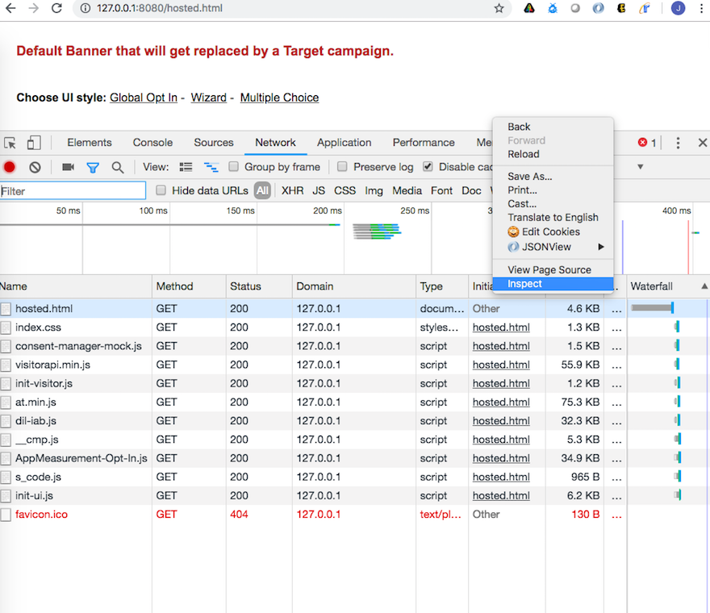

# Validerar anmälningstjänst{#validating-opt-in-service}

När du har aktiverat Anmäl dig på webbplatsen använder du valideringsmetoderna för att testa att tjänsten fungerar som förväntat med hjälp av utvecklarverktygen i webbläsaren.

## Användningsfall 1: Aktivera anmälan {#section-c8fe1ee3711b420c8186c7057abbecb3}

```
Visitor.getInstance({{YOUR_ORG_ID}}, { 
    doesOptInApply: true 
});
```



Rensa cacheminnet och cookies innan du läser in sidan.

I Chrome högerklickar du på webbsidan och väljer Inspect. På samma sätt som i skärmbilden ovan väljer du fliken *Nätverk* för att visa begäranden som gjorts från webbläsaren.

I exemplet ovan har vi följande Adobe JS-taggar installerade på sidan: ECID, AAM, Analytics och Target.

**Så här bevisar du att Opt-in fungerar som förväntat:**

Du ska inte se några begäranden till Adobe-servrar:

* demdex.net/id
* demdex.net/event
* omtrdc.net/b/ss
* omtrdc.net/m2
* everesttech.net

>[!NOTE]
>
>Du kan se ett anrop till `http://dpm.demdex.net/optOutStatus`, som är en READ ONLY-slutpunkt som används för att hämta besökarens avanmälningsstatus. Den här slutpunkten resulterar inte i att några cookies från tredje part skapas, och ingen information samlas in från sidan.

Du ska inte se några cookies som har skapats av Adobe-taggarna: (AMCV_{{YOUR_ORG_ID}}, mbox, demdex, s_cc, s_sq, everest_g_v2, everest_session_v2)

I Chrome går du till fliken *Program*, expanderar avsnittet *Cookies* under *Lagring* och väljer domännamnet för din webbplats:


## Användningsfall 2: Aktivera anmälan och lagring {#section-bd28326f52474fa09a2addca23ccdc0f}

```
Visitor.getInstance({{YOUR_ORG_ID}}, { 
    doesOptInApply: true, 
    isOptInStorageEnabled: true 
});
```

Den enda skillnaden i användningsfall 2 är att du kommer att se *en ny cookie* som kommer att innehålla avanmälningsbehörigheterna från din besökare: **adobeujs-option**

## Användningsfall 3: Aktivera deltagande och förgodkänn Adobe Analytics {#section-257fe582b425496cbf986d0ec12d3692}

```
var preApproveAnalytics = {}; 
preApproveAnalytics[adobe.OptInCategories.ANALYTICS] = true;

Visitor.getInstance({{YOUR_ORG_ID}}, { 
    doesOptInApply: true, 
    preOptInApprovals: preApproveAnalytics 
});
```

Eftersom Adobe Analytics har godkänts i förväg kommer du att se förfrågningar på fliken Nätverk till din spårningsserver:


så ser du Analytics-cookies på fliken Application:


## Användningsfall 4: Aktivera anmälan och IAB {#section-64331998954d4892960dcecd744a6d88}

```
Visitor.getInstance({{YOUR_ORG_ID}}, { 
    doesOptInApply: true, 
    isIabContext: true 
});
```

**Så här visar du ditt nuvarande IAB-medgivande på sidan:**

Öppna utvecklarverktygen och välj fliken *Konsol*. Klistra in följande kodfragment och tryck på Retur:

```
<codeblock>
  __cmp("getVendorConsents", null, function (vendorConsents) { 
     console.log("Vendor Consent:", vendorConsents); }) 
</codeblock>  
  
```

Här visas ett exempel på utdata när syften 1, 2 och 5 godkänns och Audience Manager leverantörs-ID godkänns:

* demdex.net/id: Detta anrop bevisar att ECID har begärt ett ID från demdex.net
* demdex.net/event: Detta anrop visar att datainsamlingsanropet från DIL fungerar som förväntat.
* demdex.net/dest5.html: Detta anrop visar att ID-synkronisering aktiveras.


Om något av följande inte är giltigt visas inga begäranden till Adobe-servrar och inga Adobe-cookies:

* Syfte 1, 2 ELLER 5 godkänns inte.
* Audience Manager-leverantörs-ID:t har inte godkänts.
