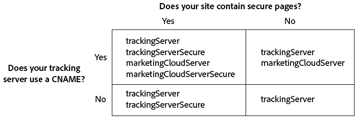

# Implementera identitetstjänsten Experience Cloud för Analytics, Audience Manager och Target {#implement-the-experience-cloud-id-service-for-analytics-audience-manager-and-target}

De här instruktionerna är till för Analytics-, Audience Manager- och Target-kunder som vill använda Experience Cloud Identity Service och som inte använder Dynamic Tag Management (DTM). Vi rekommenderar dock starkt att du använder DTM för att implementera ID-tjänsten. DTM effektiviserar implementeringsarbetsflödet och säkerställer automatiskt korrekt kodplacering och sekvensering.

>[!IMPORTANT]
>
>Läs ID-tjänsten [krav](../reference/requirements.md) innan du börjar och noterar följande krav som är specifika för den här implementeringen:
>
>* Kunder som använder s_code kan inte slutföra den här proceduren. Uppgradera till mbox-kod v61 för att slutföra den här proceduren.
>* Konfigurera och testa koden i en utvecklingsmiljö *före* implementera i produktionen.


## Steg 1: Planera för vidarebefordran på serversidan {#section-880797cc992d4755b29cada7b831f1fc}

Förutom de steg som beskrivs här, använder kunder som [!DNL Analytics] och [!DNL Audience Manager] bör migrera till vidarebefordran på serversidan. Med vidarebefordran på serversidan kan du ta bort DIL (Audience Manager datainsamlingskod) och ersätta den med [Audience Management Module](https://experienceleague.adobe.com/docs/audience-manager/user-guide/implementation-integration-guides/integration-other-solutions/audience-management-module.html). Se [vidarebefordringsdokumentation på serversidan](https://experienceleague.adobe.com/docs/analytics/admin/admin-tools/manage-report-suites/edit-report-suite/report-suite-general/server-side-forwarding/ssf.html) för mer information.

Migrering till vidarebefordran på serversidan kräver planering och samordning. Den här processen innebär externa ändringar av webbplatskoden och interna åtgärder som Adobe måste vidta för att etablera ditt konto. Många av dessa migreringsprocedurer måste faktiskt ske parallellt och släppas tillsammans. Din implementeringsväg ska följa den här händelsesekvensen:

1. Arbeta med dina [!DNL Analytics] och [!DNL Audience Manager] kontakter för att planera din ID-tjänst och migrering på serversidan. Gör det viktigt att välja en spårningsserver i den här planen.

1. Fyll i formuläret på [integrations- och provisioneringswebbplats](https://adobe.allegiancetech.com/cgi-bin/qwebcorporate.dll?idx=X8SVES) för att komma igång.

1. Implementera ID-tjänsten och [!DNL Audience Management Module] samtidigt. För att fungera som det ska [!DNL Audience Management Module] (vidarebefordran på serversidan) och ID-tjänsten måste släppas för samma uppsättning sidor samtidigt.

## Steg 2: Hämta ID-tjänstkoden {#section-0780126cf43e4ad9b6fc5fe17bb3ef86}

ID-tjänsten kräver `VisitorAPI.js` kodbibliotek. Så här hämtar du det här kodbiblioteket:

1. Gå till **[!UICONTROL Admin > Code Manager]**.
1. I Kodhanteraren klickar du på antingen **[!UICONTROL JavaScrpt (New)]** eller **[!UICONTROL JavaScript (Legacy)]**. Detta hämtar komprimerade kodbibliotek.

1. Dekomprimera kodfilen och öppna `VisitorAPI.js` -fil.

## Steg 3: Lägg till funktionen Visitor.getInstance i ID-tjänstkoden {#section-9e30838b4d0741658a7a492153c49f27}

>[!IMPORTANT]
>
>* I tidigare versioner av ID-tjänstens API placerades den här funktionen på en annan plats och en annan syntax krävdes. Om du migrerar från en version som är tidigare [version 1.4](../release-notes/notes-2015.md#section-f5c596f355b14da28f45c798df513572), notera den nya placeringen och syntaxen som beskrivs här.
>* Kod i ALL CAPS är en platshållare för faktiska värden. Ersätt den här texten med ditt företags-ID, URL för spårningsserver eller annat namngivet värde.


**Del 1: Kopiera funktionen Visitor.getInstance nedan**

```js
var visitor = Visitor.getInstance("INSERT-MARKETING-CLOUD-ORGANIZATION ID-HERE", { 
     trackingServer: "INSERT-TRACKING-SERVER-HERE", // same as s.trackingServer 
     trackingServerSecure: "INSERT-SECURE-TRACKING-SERVER-HERE", // same as s.trackingServerSecure 
 
     // To enable CNAME support, add the following configuration variables 
     // If you are not using CNAME, DO NOT include these variables 
     marketingCloudServer: "INSERT-TRACKING-SERVER-HERE", 
     marketingCloudServerSecure: "INSERT-SECURE-TRACKING-SERVER-HERE" // same as s.trackingServerSecure 
}); 
```

**Del 2: Lägga till funktionskod i Visitor API.js-filen**

Placera `Visitor.getInstance` i slutet av filen efter kodblocket. Den redigerade filen ska se ut så här:

```js
/* 
========== DO NOT ALTER ANYTHING BELOW THIS LINE ========== 
Version and copyright section 
*/ 
 
// Visitor API code library section 
 
// Put Visitor.getInstance at the end of the file, after the code library 
 
var visitor = Visitor.getInstance("INSERT-MARKETING-CLOUD-ORGANIZATION ID-HERE", { 
     trackingServer: "INSERT-TRACKING-SERVER-HERE", // same as s.trackingServer 
     trackingServerSecure: "INSERT-SECURE-TRACKING-SERVER-HERE", // same as s.trackingServerSecure 
 
     // To enable CNAME support, add the following configuration variables 
     // If you are not using CNAME, DO NOT include these variables 
     marketingCloudServer: "INSERT-TRACKING-SERVER-HERE", 
     marketingCloudServerSecure: "INSERT-SECURE-TRACKING-SERVER-HERE" // same as s.trackingServerSecure 
}); 
```

## Steg 4: Lägg till ditt organisations-ID för Experience Cloud i Visitor.getInstance {#section-e2947313492546789b0c3b2fc3e897d8}

I `Visitor.getInstance` funktion, ersätt `INSERT-MARKETING-CLOUD-ORGANIZATION ID-HERE` med ditt företags-ID för Experience Cloud. Om du inte känner till ditt organisations-ID kan du hitta det på administrationssidan för Experience Cloud. Den redigerade funktionen kan se ut ungefär som i exemplet nedan.

`var visitor = Visitor.getInstance("1234567ABC@AdobeOrg", { ...`

>[!IMPORTANT]
>
>*Gör inte* ändra skiftläget för tecknen i ditt organisations-ID. ID:t är skiftlägeskänsligt och måste användas exakt som angivet.

## Steg 5: Lägg till dina spårningsservrar i Visitor.getInstance {#section-0dfc52096ac2427f86045aab9a0e0dfc}

Analytics använder spårningsservrar för datainsamling.

**Del 1: Hitta URL:er till spårningsservern**

Kontrollera `s_code.js` eller `AppMeasurement.js` filer för att hitta spårningsserverns URL:er. Du vill att URL:erna som anges av dessa variabler ska vara:

* `s.trackingServer`
* `s.trackingServerSecure`

**Del 2: Ange spårningsservervariabler**

Så här tar du reda på vilka spårningsservervariabler som ska användas:

1. Besvara frågorna i beslutsmatrisen nedan. Använd de variabler som motsvarar dina svar.
1. Ersätt platshållarna för spårningsservern med URL:erna för spårningsservern.
1. Ta bort oanvända spårningsserver- och Experience Cloud-servervariabler från koden.



>[!NOTE]
>
>Om det används matchar du URL:erna för Experience Cloud-servern med deras motsvarande URL:er för spårningsservern så här:

* URL för Experience Cloud-server = URL för spårningsserver
* Säker URL för Experience Cloud-server = spårningsserverns säkra URL

Om du är osäker på hur du hittar spårningsservern kan du läsa [Vanliga frågor](../faq-intro/faq.md) och [Fylla i variablerna trackingServer och trackingServerSecure korrekt](https://helpx.adobe.com/analytics/kb/determining-data-center.html#).

## Steg 6: Uppdatera filen AppMeasurement.js {#section-5517e94a09bc44dfb492ebca14b43048}

Det här steget kräver [!UICONTROL AppMeasurement]. Du kan inte fortsätta om du fortfarande använder s_code.

Lägg till `Visitor.getInstance` funktionen som visas nedan för `AppMeasurement.js` -fil. Placera den i det avsnitt som innehåller konfigurationer som `linkInternalFilters`, `charSet`, `trackDownloads`, osv. :

`s.visitor = Visitor.getInstance("INSERT-MARKETING-CLOUD-ORGANIZATION ID-HERE");`

>[!IMPORTANT]
>
>Nu bör du ta bort [!DNL Audience Manager] Koda DIL och ersätt den med Audience Management Module. Se [Implementera vidarebefordran på serversidan](https://experienceleague.adobe.com/docs/analytics/admin/admin-tools/server-side-forwarding/ssf.html) för instruktioner.

***(Valfritt, men rekommenderas)* Skapa en anpassad propp **

Ange en anpassad svällning i `AppMeasurement.js` för att mäta täckningen. Lägg till den här anpassade sviten i `doPlugins` din `AppMeasurement.js` fil:

```js
// prop1 is used as an example only. Choose any available prop. 
s.prop1 = (typeof(Visitor) != "undefined" ? "VisitorAPI Present" : "VisitorAPI Missing");
```

## Steg 7: Lägg till API-kod för besökare på sidan {#section-c2bd096a3e484872a72967b6468d3673}

Placera ` [!UICONTROL VisitorAPI.js]` i `<head>` -taggar på varje sida. När du `VisitorAPI.js` till din sida:

* Placera den i början av `<head>` -avsnittet visas före andra lösningstaggar.
* Den måste köras före AppMeasurement och koden för andra [!DNL Experience Cloud] lösningar.

## Steg 8: (Valfritt) Konfigurera en respitperiod {#section-aceacdb7d5794f25ac6ff46f82e148e1}

Om något av dessa fall gäller din situation, fråga [Kundtjänst](https://helpx.adobe.com/marketing-cloud/contact-support.html) för att konfigurera en temporär [respitperiod](../reference/analytics-reference/grace-period.md). Gränsperioder kan vara upp till 180 dagar. Du kan förnya en respitperiod om det behövs.

**Partiell implementering**

Du behöver en respitperiod om du har sidor som använder ID-tjänsten och vissa sidor som inte gör det, och de alla rapporterar till samma Analytics-rapportserie. Det här är vanligt om du har en global rapportserie som rapporterar över domäner.

Avbryt respitperioden när ID-tjänsten har distribuerats på alla dina webbsidor som rapporterar till samma rapportsvit.

**s_vi Cookie-krav**

Du behöver en respitperiod om du kräver att nya besökare ska ha en s_vi-cookie efter migrering till ID-tjänsten. Detta är vanligt om implementeringen läser s_vi-cookien och lagrar den i en variabel.

Avbryt respitperioden när implementeringen kan hämta MID i stället för att läsa s_vi-cookien.

Se även [Cookies och Experience Cloud Identity Service](../introduction/cookies.md).

**Integrering av Clickstream-data**

Du behöver en frist om du skickar data till ett internt system från en datafeed i Clickstream och som bearbetar använder `visid_high` och `visid_low` kolumner.

Avbryt respitperioden efter att dataöverföringsprocessen kan använda `post_visid_high` och `post_visid_low` kolumner.

Se även [Referens för Clickstream-datakolumn](https://experienceleague.adobe.com/docs/analytics/export/analytics-data-feed/data-feed-overview.html).

## Steg 9: Testa och verifiera {#section-f857542bfc70496dbb9f318d6b3ae110}

The [!DNL Experience Cloud] lösningar i den här implementeringen returnerar ID:n i form av nyckelvärdepar. Varje lösning använder olika nycklar (t.ex. [!DNL Analytics] SDID jämfört med [!DNL Target] mboxMCSDID) för samma ID. Om du vill testa implementeringen läser du in sidorna i en utvecklingsmiljö. Använd webbläsarkonsolen eller programvara som övervakar HTTP-begäranden och svar för att kontrollera ID:n som anges nedan. ID-tjänsten har implementerats korrekt när nyckelvärdepar som anges nedan returnerar samma ID-värden.

>[!TIP]
>
>Du kan använda [Felsökning för Adobe](https://experienceleague.adobe.com/docs/analytics/implementation/validate/debugger.html) eller [Charles HTTP-proxy](https://www.charlesproxy.com/) om du vill söka efter dessa lösningsspecifika ID:n. Du bör dock kunna använda det verktyg eller den felsökare som passar dig bäst.

**Alla lösningar**

Sök efter:

* [AMCV cookie](../introduction/cookies.md) i domänen där sidan finns.
* [!DNL Experience Cloud] ID (MID) med [!DNL Adobe] felsökningsprogram eller det felsökningsverktyg du föredrar.

Ytterligare kontroller som hjälper dig att avgöra om ID-tjänsten fungerar som den ska finns i [Testa och verifiera Experience Cloud Identity Service](../implementation-guides/test-verify.md).

**Analytics** 

Sök efter SDID-identifieraren i JavaScript-begäran. Analytics SDID ska matcha Target mboxMCSDID.

Om testerna returnerar ett ID, innebär det något av följande:

* Du är en återkommande besökare som håller på att migrera äldre [!DNL Analytics] ID:n.
* Du har en [respitperiod](../reference/analytics-reference/grace-period.md) aktiverat.

När du ser ett AID kontrollerar du dess värde mot [!DNL Target] mboxMCAVID. Dessa värden är identiska när ID-tjänsten har implementerats korrekt.

**Audience Manager**

Information om hur du testar vidarebefordran på serversidan finns i [Så här verifierar du implementeringen av vidarebefordring på serversidan](https://experienceleague.adobe.com/docs/analytics/admin/admin-tools/server-side-forwarding/ssf-verify.html).

**Target**

Sök efter:

* mboxMCGVID
* mboxMCSDID (mboxMCSDID ska matcha Analytics SDID.)

Om dina tester returnerar ett mboxMCAVID, visar det något av följande:

* Du är en återkommande besökare som håller på att migrera äldre [!DNL Analytics] ID:n.
* Du har aktiverat en respitperiod.

När du ser ett mboxMCAVID kontrollerar du dess värde mot [!DNL Analytics] STÖD. Dessa värden är identiska när ID-tjänsten har implementerats korrekt.

**Distribution**

## Steg 10: Distribuera {#section-4188fa95e7dc455a986b48a6c517c1c9}

Distribuera koden när den har testats.

Om du aktiverade en respitperiod:

* Kontrollera att Analytics ID (AID) och MID finns i bildbegäran.
* Kom ihåg att inaktivera respitperioden när du har uppfyllt [kriterier för upphörande](../implementation-guides/setup-aam-analytics-target.md#section-aceacdb7d5794f25ac6ff46f82e148e1).
