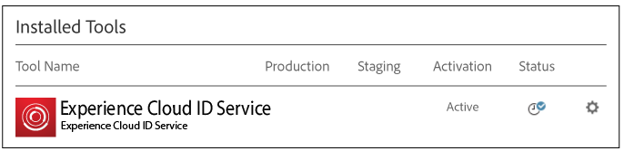

# Implementering med dynamisk tagghantering {#implementation-with-dynamic-tag-management}

Äldre implementeringar använder Dynamic Tag Management (DTM) för att konfigurera, driftsätta och integrera Experience Cloud Identity Service med era andra Experience Cloud-lösningar.

## Implementering med dynamisk tagghantering {#topic-6f4ed5d96977406ca991e50f3fbd5b01}

Äldre implementeringar använder Dynamic Tag Management (DTM) för att konfigurera, driftsätta och integrera Experience Cloud Identity Service med era andra Experience Cloud-lösningar.

>[!NOTE]
>
>För närvarande är [Adobe Experience Platform Launch](https://docs.adobelaunch.com/) det rekommenderade och rekommenderade implementeringsverktyget eftersom det förenklar komplexa tagghanteringsuppgifter och automatiserar kodplaceringen utöver DTM:s funktioner. Se [Implementera med Launch](../implementation-guides/ecid-implement-with-launch.md).

## Dynamisk tagghantering och ID-tjänsten {#section-4a4c4fac5d0a4cbbaff8e1833f73657c}

[Med Dynamic Tag Management](https://marketing.adobe.com/resources/help/en_US/dtm/) kan du konfigurera, distribuera och hantera din ID-tjänstinstans och relaterade [!DNL Experience Cloud] lösningsintegreringar. DTM underlättar implementeringsprocessen eftersom det är nära integrerat med ID-tjänsten och andra Experience Cloud-lösningar. Lägg till och konfigurera Experience Cloud ID-verktyget och ange information, till exempel:

* Experience Cloud-organisations-ID (fylls i automatiskt om det är länkat till Experience Cloud)
* Analysspårningsserver (säker och osäker)
* Experience Cloud-server (för förstapartsspårningsservrar)

DTM är kostnadsfritt tillgängligt för alla [!DNL Experience Cloud] kunder.

**Komma igång med DTM**

DTM är ett enkelt men kraftfullt verktyg. Om du inte redan använder den bör du göra det. Se DTM- [dokumentationen](https://marketing.adobe.com/resources/help/en_US/dtm/c_overview.html) och [DTM Jump Start-videor](https://marketing.adobe.com/resources/help/en_US/dtm/jump-start-videos.html) för att komma igång med den här tjänsten. Instruktioner om hur du konfigurerar ID-tjänsten med DTM finns i informationen och procedurerna i avsnitten nedan.

## Riktlinjer för distribution {#concept-54a2ec49af8f4bfca9207b1d404e8e1a}

Granska dessa krav och procedurer innan du försöker implementera Experience Cloud Identity Service med Dynamic Tag Management (DTM).

<!--
mcvid-dtm-deployment.xml
-->

**Tillhandahåll ditt konto**

Innan du kan komma igång bör du kontrollera att din organisation och dina lösningar har etablerats för [!DNL Experience Cloud] och att du är bekant med [!DNL Dyanamic Tag Management]. Den här dokumentationen kan hjälpa dig att komma igång:

* [Möjliggör lösningar för bastjänster](https://marketing.adobe.com/resources/help/en_US/mcloud/core_services.html): Implementera Experience Cloud och bli administratör. Denna process moderniserar era era lösningar för centrala tjänster som kundattribut och Experience Cloud-målgrupper.
* [Komma igång med dynamisk tagghantering](https://marketing.adobe.com/resources/help/en_US/dtm/get_started.html)
* [Hoppa över startvideor](https://marketing.adobe.com/resources/help/en_US/dtm/jump-start-videos.html): En serie korta videor som visar hur du utför grundläggande DTM-uppgifter.

**Placering av ID-tjänstkod och lastorder**

ID-tjänsten fungerar genom att begära och ta emot ett unikt ID från [!DNL Adobe] datainsamlingsservrarna. För att din ID-tjänstkod ska fungera på rätt sätt måste den vara:

* Det första kodblocket [!DNL Adobe] som körs på sidan.
* Placeras så högt på sidan som möjligt, vanligtvis inom `<head>` kodblocket.

Så länge du underhåller alla dina [!DNL Adobe] lösningar och kodbibliotek i DTM ser det till att din ID-tjänstkod placeras på rätt plats och aktiveras vid rätt tidpunkt.

**Validera regional datainsamling**

Kunderna måste tillhandahålla en CNAME eller använda `*.sc.omtrdc` för [regional datainsamling](https://marketing.adobe.com/resources/help/en_US/whitepapers/rdc/) . Hämta de specifika inställningarna för RDC från din [!DNL Adobe] konsult.

**Konfigurera rapportsviter för Analytics**

Nya [!DNL Analytics] kunder bör [skapa en rapportserie](https://marketing.adobe.com/resources/help/en_US/reference/new_report_suite.html) för datainsamling.

## Implementera Experience Cloud Identity Service med DTM {#task-a659cf19dea84ad48edabe0b72ef9f5c}

Följ de här stegen för att implementera ID-tjänsten med Dynamic Tag Management (DTM).

**Förutsättningar**

* Aktivera dina lösningar för [!DNL Experience Cloud] och verifiera att du har administratörsbehörighet. Se [Aktivera lösningar för bastjänster](https://marketing.adobe.com/resources/help/en_US/mcloud/core_services.html).

* Skapa en webbegenskap i DTM. Se dokumentationen för DTM [Create a Web Property](https://marketing.adobe.com/resources/help/en_US/dtm/web_property.html) eller videon [](https://marketing.adobe.com/resources/help/en_US/dtm/admin-jump-start.html)Admin Jump Start.

<!--
mcvid-dtm-implement.xml
-->

**Implementeringssteg** Så här implementerar du ID-tjänsten med DTM:

1. Klicka på den webbegenskap som du vill arbeta med i DTM [!UICONTROL Dashboard].
1. Klicka på på fliken **[!UICONTROL Overview]** för den valda webbegenskapen **[!UICONTROL Add a Tool]**.
1. Klicka på i **[!UICONTROL Tool Type]** listan **[!UICONTROL Experience Cloud Identity Service]**.

   >[!NOTE]
   >
   >Den här åtgärden fyller i **[!UICONTROL Experience Cloud Organization ID]** rutan med ditt organisations-ID. Om ditt DTM-konto inte är länkat till [!DNL Experience Cloud]måste du ange detta ID. Mer information om hur du länkar ditt konto finns i [Länka konton i Experience Cloud](https://marketing.adobe.com/resources/help/en_US/mcloud/organizations.html). Se [kraven](../reference/requirements.md#section-a02f537129a64ffbb690d5738d360c26) för mer information om hur du hittar ditt företags-ID.

1. Skriv namnet på spårningsservern i **[!UICONTROL Tracking Server]** rutan. Om du är osäker på hur du hittar spårningsservern kan du läsa [Vanliga frågor](../faq-intro/faq.md) och [Korrekt fylla i variablerna](https://helpx.adobe.com/analytics/kb/determining-data-center.html#)trackingServer och trackingServerSecure.
1. Klicka **[!UICONTROL Create Tool]** och **[!UICONTROL Save Changes]**.

   När du har sparat är ID-tjänsten konfigurerad som ett verktyg i DTM. Den är dock inte klar att användas än. DTM-verktyget måste fortfarande gå igenom DTM-publicerings-/godkännandeprocessen och du kanske vill konfigurera ytterligare parametrar. Information om DTM-godkännandeprocessen finns i videon [User Basics Jump Start](https://marketing.adobe.com/resources/help/en_US/dtm/user-basics-jump-start.html) (på engelska). Mer information om de ytterligare parametrar som du kan lägga till i DTM finns i Inställningar för [Experience Cloud Identity Service för DTM](../implementation-guides/standard.md#concept-fb6cb6a0e6cc4f10b92371f8671f6b59).

## Inställningar för identitetstjänsten i Experience Cloud för DTM {#concept-fb6cb6a0e6cc4f10b92371f8671f6b59}

Beskriver fälten [!UICONTROL Organization ID], [!UICONTROL General] och [!UICONTROL Customer Settings] hur de används av [!DNL Experience Cloud] ID-tjänsten.

<!--
mcvid-dtm-settings.xml
-->

## Hur hittar jag de här inställningarna? {#section-c5b2d1c928944ae2b8565c1b182fe575}

Inställningarna är tillgängliga när du har lagt till och sparat ID-tjänsten som ett verktyg i Dynamic Tag Management (DTM). Du kan även få åtkomst till de här inställningarna genom att klicka på kugghjulsikonen i delen [!UICONTROL Installed Tools] av din DTM-webbegenskap.



## Organisations-ID {#section-949b5a0d8af940558b04ff675cf53f77}

Detta är det ID som krävs av och är associerat med det tilldelade [!DNL Experience Cloud] företaget. En organisation är den enhet som gör det möjligt för en administratör att konfigurera användare, grupper och styra åtkomst till enkel inloggning i [!DNL Experience Cloud]. Organisations-ID:t är en 24 tecken lång alfanumerisk sträng som följs av (och måste innehålla) @AdobeOrg. [!DNL Experience Cloud] administratörer hittar detta ID i [Experience Cloud > Verktyg](https://marketing.adobe.com/resources/help/en_US/mcloud/admin_getting_started.html).


Se även [cookies och Experience Cloud Identity Service](../introduction/cookies.md).

## Allmänna inställningar {#section-071d358e40f84629a8901b893dd61392}

Med de här inställningarna kan du ange spårningsservrar, kodversioner och lägga till andra variabler.


I följande tabell visas och definieras [!UICONTROL General] inställningarna.

**Begär besökar-ID automatiskt**

När det här alternativet är markerat anropar Dynamic Tag Management automatiskt metoden innan någon av de Adobe-lösningar som använder Experience Cloud Identity Service läses in. `getMarketingCloudVisitorID()`

Se [getMarketingCloudVisitorID](../library/get-set/getmcvid.md).

**Analytics Tracking Server**

Namnet på spårningsservern som används för insamling av analysdata. Detta är den domän där bildbegäran och cookie skrivs (t.ex. `http://site.omtrdc.net`).

Om du inte känner till URL:erna för spårningsservern kontrollerar du dina `s_code.js` eller `AppMeasurement.js` filerna. Du vill att URL:en ska anges av `s.trackingServer` variabeln.

Se [trackingServer](https://marketing.adobe.com/resources/help/en_US/sc/implement/trackingServer.html) och Fyll i variabeln [trackingServer och trackingServerSecure](https://helpx.adobe.com/analytics/kb/determining-data-center.html#)korrekt.

**Säker spårningsserver**

Namnet på den säkra spårningsservern som används för insamling av analysdata. Detta är den domän där bildbegäran och cookie skrivs (t.ex. `https://site.omtrdc.net`).

Om du inte känner till URL:erna för spårningsservern kontrollerar du dina `s_code.js` eller `AppMeasurement.js` filerna. Du vill att URL:en ska anges av `s.trackingServerSecure` variabeln.

Se [trackingServer](https://marketing.adobe.com/resources/help/en_US/sc/implement/trackingServer.html) och Fyll i variabeln [trackingServer och trackingServerSecure](https://helpx.adobe.com/analytics/kb/determining-data-center.html#)korrekt.

**Experience Cloud Server**

Om ditt företag använder CNAME (First-party data collection) för att använda cookies från tredje part i en tredjepartskontext anger du spårningsservern här (t.ex. `http://metrics.company.com`.).

**Experience Cloud Server Secure**

Om ditt företag använder CNAME (First-party data collection) för att använda cookies från tredje part i en tredjepartskontext anger du spårningsservern här (t.ex. `https://metrics.company.com`.).

**Biblioteksversion**

Anger den version av ID-tjänstkodbiblioteket ( `VisitorAPI.js`) som du vill använda. Du kan inte redigera dessa menyalternativ.

**Inställningar**

I dessa fält kan du lägga till [funktionsvariabler](../library/function-vars/function-vars.md) som nyckelvärdepar. Klicka **[!UICONTROL Add]** för att lägga till en eller flera variabler i implementeringen av din ID-tjänst.


>[!IMPORTANT]
>
>Här ställer du in `cookieDomain` variabeln. Det krävs för flerdelsdomäner på den översta nivån där någon av de sista två delarna av URL:en är > två tecken. Se dokumentationen om konfigurationsvariabler som är länkad ovan.

## Kundinställningar {#section-238d1272c1504d148fe38fb0ae5d71c2}

Ytterligare fält som gör att du kan lägga till en integreringskod eller status för autentiserat läge.


**Integrationskod**

En integrationskod är ett unikt, kundtillhandahållet ID. Integrationskoden ska innehålla det värde som du använde för att [skapa en datakälla](https://marketing.adobe.com/resources/help/en_US/aam/create-datasource.html) i [!DNL Audience Manager].

**Värde**

Värdet ska vara ett dataelement som innehåller användar-ID:t. Dataelement är lämpliga behållare för dynamiska värden som ID:n från ett klientspecifikt internt system.

**Autentiseringsläge**

Alternativ som definierar eller identifierar besökare utifrån deras autentiseringsstatus (t.ex. inloggad, utloggad). See [Customer IDs and Authentication States](../reference/authenticated-state.md).

## Testa och verifiera Experience Cloud Identity Service {#concept-644fdbef433b46ba9c0634ac95eaa680}

Dessa instruktioner, verktyg och procedurer hjälper dig att avgöra om ID-tjänsten fungerar som den ska. Dessa tester gäller för ID-tjänsten i allmänhet och för olika ID-tjänster och [!DNL Experience Cloud] lösningskombinationer.

<!--
mcvid-test-verify.xml
-->

## Innan du börjar {#section-b1e76ad552ed4eb793b6e521a55127d4}

Viktig information innan du börjar testa och verifiera ID-tjänsten.

**Webbläsarmiljöer**

När du testar i en normal webbläsarsession bör du rensa webbläsarcachen före varje test.

Du kan också testa ID-tjänsten i en anonym eller inkognitiv webbläsarsession. I en anonym session behöver du inte rensa dina webbläsarcookies eller cacheminnen före varje test.

**verktyg**

Med [Adobes felsökningsprogram](https://marketing.adobe.com/resources/help/en_US/sc/implement/debugger.html) och [Charles HTTP-proxyn](https://www.charlesproxy.com/) kan du avgöra om ID-tjänsten har konfigurerats för att fungera korrekt med Analytics. Informationen i det här avsnittet baseras på resultaten från Adobes felsökare och Charles. Du bör dock kunna använda det verktyg eller den felsökare som passar dig bäst.

## Testa med Adobe Debugger {#section-861365abc24b498e925b3837ea81d469}

Din tjänstintegrering är korrekt konfigurerad när du ser ett [!DNL Experience Cloud ID] (MID) i [!DNL Adobe] felsökningssvaret. Mer information om MID finns i [Cookies och Experience Cloud Identity Service](../introduction/cookies.md) .

Så här verifierar du statusen för ID-tjänsten med [!DNL Adobe] felsökaren [](https://marketing.adobe.com/resources/help/en_US/sc/implement/debugger.html):

1. Rensa dina webbläsarcookies eller öppna en anonym webbläsarsession.
1. Läs in testsidan som innehåller ID-tjänstkoden.
1. Öppna [!DNL Adobe] felsökningsprogrammet.
1. Kontrollera resultatet för ett MID.

## Om Adobe Debugger-resultat {#section-bd2caa6643d54d41a476d747b41e7e25}

MID lagras i ett nyckelvärdepar som använder den här syntaxen: `MID= *`Experience Cloud ID`*`. Felsökaren visar den här informationen som visas nedan.

**Lyckades**

ID-tjänsten har implementerats korrekt om du ser ett svar som ser ut ungefär så här:

```
mid=20265673158980419722735089753036633573
```

Om du är en [!DNL Analytics] kund kan du se ett [!DNL Analytics] ID (AID) förutom MID. Det här händer:

* Med några av era tidiga/långa webbplatsbesökare.
* Om du har aktiverat en respitperiod.

**Fel**

Kontakta [kundtjänst](https://helpx.adobe.com/marketing-cloud/contact-support.html) om felsökaren:

* Returnerar inget MID.
* Returnerar ett felmeddelande som anger att ditt partner-ID inte har etablerats.

## Testa med Charles HTTP-proxy {#section-d9e91f24984146b2b527fe059d7c9355}

Så här verifierar du ID-tjänstens status med Charles:

1. Rensa dina webbläsarcookies eller öppna en anonym webbläsarsession.
1. Starta Charles.
1. Läs in testsidan som innehåller ID-tjänstkoden.
1. Kontrollera om det finns förfrågningar, svarssamtal och data som beskrivs nedan.

## Charles results {#section-c10c3dc0bb9945cbaffcf6fec7082fab}

I det här avsnittet finns information om var du ska söka och vad du ska leta efter när du använder Charles för att övervaka HTTP-anrop.

### Slutförda ID-tjänstbegäranden i Charles

Koden för din ID-tjänst fungerar korrekt när funktionen gör ett JavaScript-anrop till `Visitor.getInstance` `dpm.demdex.net`. En lyckad begäran innehåller ditt [organisations-ID](../reference/requirements.md#section-a02f537129a64ffbb690d5738d360c26). Organisations-ID skickas som ett nyckelvärdepar som använder den här syntaxen: `d_orgid= *`organisations-ID`*`. Leta efter `dpm.demdex.net` och JavaScript-anropen under [!UICONTROL Structure] fliken. Leta efter ditt organisations-ID på [!UICONTROL Request] fliken.


### Slutförda ID-tjänstsvar i Charles

Ditt konto har etablerats korrekt för ID-tjänsten när svaret från [datainsamlingsservrarna](https://marketing.adobe.com/resources/help/en_US/aam/c_compcollect.html) (DCS) returnerar ett MID. MID returneras som ett nyckelvärdepar som använder den här syntaxen: `d_mid: visitor Experience Cloud ID`. Leta efter MID på [!UICONTROL Response] fliken enligt nedan.


### Misslyckade ID-tjänstsvar i Charles

Ditt konto har inte etablerats korrekt om MID saknas i DCS-svaret. Ett misslyckat svar returnerar en felkod och ett felmeddelande på [!UICONTROL Response] fliken enligt nedan. Kontakta kundtjänst om det här felmeddelandet visas i DCS-svaret.


Mer information om felkoder finns i [DCS-felkoder, meddelanden och exempel](https://marketing.adobe.com/resources/help/en_US/aam/dcs_error_codes.html).

>[!MORELIKETHIS]
>
>* [Webbegenskaper](https://marketing.adobe.com/resources/help/en_US/dtm/web_property.html)

