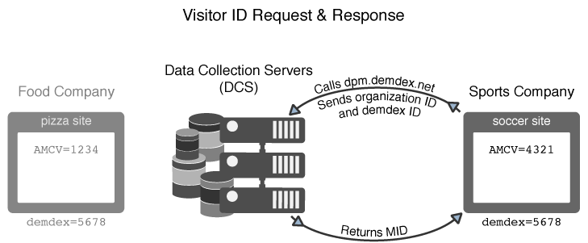

# Så här begär och anger Experience Cloud Identity Service ID:n{#how-the-experience-cloud-id-service-requests-and-sets-ids}

En översikt över ID-begäran och svarsprocessen. De här exemplen omfattar ID-tilldelning på enskilda webbplatser, på olika webbplatser och för webbplatser som hanteras av olika Experience Cloud-kunder med egna företags-ID:n.

>[!NOTE]
>
>Om du inte är bekant med hur besökar-ID skapas i Experience Cloud Identity Service kan du ägna en stund åt att granska [Experience Cloud](../introduction/cookies.md).

## Begär ett Experience Cloud-ID {#section-0b5e261fbd0547d9b9a1680e5ce536cc}

I följande exempel visas hur ID-tjänsten begär och tar emot besökar-ID:t för Experience Cloud. I dessa exempel används två fiktiva företag, Food Company och Sports Company, för att visa dataflöden för ID-förfrågningar och -svar. Varje företag har ett unikt Experience Cloud-organisations-ID och har implementerat ID-tjänstkoden på alla sina platser. De här användningsexemplen representerar dataflöden för en allmän ID-tjänstimplementering utan analyser, äldre ID:n eller webbläsare som blockerar cookies från tredje part.

**Första begäran**

I det här exemplet kommer en ny besökare till pizzabiten som hanteras av Food Company. The Food Company har ID-tjänstkod på pizzans webbplats. När pizzabiten läses in söker ID-tjänstkoden efter AMCV-cookien i pizzabdomänen.

* Om AMCV-cookien är inställd har besökaren ett Experience Cloud-ID. I det här fallet spårar cookien besökaren och delar data med andra Experience Cloud-lösningar.
* Om AMCV-cookien inte är inställd anropar ID-tjänstkoden en regional [datainsamlingsserver](https://experienceleague.adobe.com/docs/analytics/technotes/rdc/regional-data-collection.html?lang=en) (DCS) på `dpm.demdex.net/id` (se även [Förstå anrop till Demdex-domänen](https://experienceleague.adobe.com/docs/audience-manager/user-guide/reference/demdex-calls.html?lang=en). I samtalet ingår organisations-ID för Food Company. Organisations-ID anges i `Visitor.getInstance` ID-tjänstkodens funktion.

**Första svaret**

I svaret returnerar DCS [!DNL Experience Cloud] ID (MID) och demdex cookie. ID-tjänstkoden skriver MID-värdet till AMCV-cookien. Exempel: DCS returnerar MID-värdet 1234. Den skulle lagras som AMCV-cookien som `mid|1234` och i den första parten, pizzabdomänen. Demdex-cookien innehåller också ett unikt ID (vi kallar det 5678). Den här cookie-filen anges i domänen demdex.net från tredje part, som är skild från pizzdomänen.

Som du kommer att se i nästa exempel tillåter demdex-ID och organisations-ID-tjänsten att skapa och returnera rätt MID när besökaren flyttar till en annan plats som tillhör livsmedelsföretaget.

## Begäran och svar på flera webbplatser {#section-15ea880453af467abd2874b8b4ed6ee9}

I det här exemplet navigerar vår besökare på Food Company till tacos-webbplatsen från pizzabiten. The Food Company har ID-tjänstkod på tacos webbplats. Besökaren har aldrig varit på takos webbplats.

Under dessa förhållanden finns det ingen AMCV-cookie på tacos-sajten. Och ID-tjänsten kan inte använda AMCV-cookie-filen på pizzabiten eftersom den är specifik för pizzabdomänen. Därför måste ID-tjänsten anropa DCS för att söka efter och begära ett besökar-ID. I det här fallet innehåller DCS-anropet Livsmedelsföretagets organisations-ID *och* demodex-ID. Och kom ihåg att demdex-ID hämtas från pizzabiten och lagras som en cookie från tredje part i domänen demdex.net.

När DCS tar emot organisations-ID:t och demdex-ID:t skapas och returneras rätt MID för vår besökare. Eftersom MID härleds matematiskt från organisations-ID och demdex-ID innehåller AMCV-cookien MID-värdet, `mid = 1234`.

## ID-begäranden från andra platser {#section-ba9a929e50d64b0aba080630fd83b6f1}

I det här exemplet lämnar vår besökare Livsmedelsföretagets webbplatser och navigerar till den fotbollsplats som ägs av Sports Company. När besökaren kommer till fotbollsplatsen fungerar ID-kontrollen och förfrågningsprocessen på samma sätt som beskrivs i de föregående exemplen. Men eftersom Sports Company har ett eget organisations-ID returnerar ID-tjänsten ett annat MID. Det nya MID:t är unikt för de domäner som kontrolleras av Sports Company och gör att företaget kan spåra och dela besöksdata över olika lösningar i [!DNL Experience Cloud]. Detta demdex-ID är detsamma för den här besökaren eftersom det finns i en cookie från tredje part och finns kvar i olika domäner.

