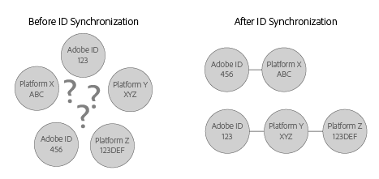

# Förstå ID-synkronisering och matchningsfrekvenser{#understanding-id-synchronization-and-match-rates}

En översikt över ID-synkroniseringsprocesser och matchningsfrekvenser i Experience Cloud Identity Service, inklusive Adobe Media Optimizer och ID-tjänsten.

## ID-synkronisering och matchningsfrekvenser {#section-f652aae7234945e89d26dd833c5215fb}

ID-synkroniseringen matchar ID:n som tilldelats av ID-tjänsten till ID:n som tilldelats webbplatsbesökare av våra kunder. Exempel: ID-tjänsten har tilldelat besökar-ID 1234. En annan plattform känner den här besökaren med ID 4321. ID-tjänsten mappar dessa ID:n under synkroniseringsprocessen. Resultatet lägger till nya datapunkter i det som våra kunder vet om sina webbplatsbesökare. Och om ID-tjänsten inte kan matcha ett ID skapas ett nytt ID som används för framtida synkronisering.

Matcha frekvenser mäter och validerar effektiviteten i ID-synkroniseringsprocessen. Höga matchningsfrekvenser tyder på att en viss tjänst blir mer effektiv och ger åtkomst till en större webbpublik än en tjänst med låga matchningsfrekvenser. Att jämföra matchningsfrekvenser är ett kvantifierbart sätt att utvärdera olika integrerade annonseringsplattformar.

**Säkerställa höga matchningsfrekvenser**

För att generera höga matchningsfrekvenser är det viktigt att konfigurera ID-tjänsten korrekt (se [standardimplementeringsguiden](../implementation-guides/standard.md#concept-89cd0199a9634fc48644f2d61e3d2445)). En korrekt implementering hjälper till att säkerställa höga matchningsfrekvenser eftersom gör att ID-tjänsten kan ställa in de cookies den behöver för att fungera och synkronisera ID:n med aktiverade datapartners. Faktorer som långsamma internetanslutningar, datainsamling från mobila enheter eller trådlösa nätverk kan dock påverka hur väl ID-tjänsten samlar in, synkroniserar och matchar ID:n. Dessa klientsidesvariabler ligger utanför ID-tjänstens eller [!DNL Adobe]kundens kontroll.

## ID-synkroniseringsprocessen beskrivs {#section-a541a85cbbc74f5682824b1a2ee2a657}

ID-tjänsten synkroniserar ID:n i realtid. Den här processen fungerar i webbläsaren i stället för via en server-till-server-dataöverföring. I följande tabell beskrivs stegen i ID-synkroniseringsprocessen.

**Steg 1: Läs in sida**

När en besökare kommer till webbplatsen och läser in en sida gör funktionen ett `Visitor.getInstance` CORS  - eller JSON-P-anrop till ID-tjänsten. ID-tjänsten svarar med en cookie som innehåller besökarens [!DNL Experience Cloud] -ID (MID). MID är ett unikt ID som tilldelas varje besökare. Se även [cookies och Experience Cloud Identity Service](../introduction/cookies.md).

**Steg 2: Läs in iFrame**

Medan sidans brödtext läses in läser ID-tjänsten in en iFrame som kallas för *`Destination Publishing iFrame`*. iFrame [!UICONTROL för] målpublicering läses in i en annan domän än den överordnade sidan. Den här designen hjälper till att säkerställa sidprestanda och förbättrar säkerheten eftersom iFrame:

* Läser in asynkront i relation till överordnad sida. Det innebär att den överordnade sidan kan läsas in oberoende av iFrame för [!UICONTROL målpublicering]. Inläsning av iFrame och inläsning av ID-synkroniseringspixlar inifrån iFrame påverkar inte den överordnade sidan eller användarupplevelsen.
* Läser in så snabbt som möjligt. Om detta är för snabbt kan du läsa in iFrame efter fönstrets load-händelse (rekommenderas inte). Mer information finns i [idSyncAttachIframeOnWindowLoad](../library/function-vars/idsyncattachiframeonwindowload.md#reference-b86b7112e0814a4c82c4e24c158508f4) .
* Förhindrar att kod i iFrame får åtkomst till eller påverkar den överordnade sidan.

Se även [How the Experience Cloud Identity Service Requests and Sets IDs...](../introduction/id-request.md#concept-2caacebb1d244402816760e9b8bcef6a).

**Steg 3: Synkronisering av Fire ID**

ID-synkroniseringen är en URL som utlöses i iFrame för målpublicering. Som visas i det här generiska exemplet innehåller en URL för synkronisering av ett ID en partner och en omdirigerings-URL, som är en omdirigering tillbaka till [!DNL Adobe] som innehåller deras ID.

`http://abc.com?partner_id=abc&sync_id=123&redir=http://dpm.demdex.net/ibs:dpid=<ADOBE_PARTNER_ID>&dpuuid=<PARTNER_UUID>`

Se även [ID-synkronisering för inkommande dataöverföringar](https://docs.adobe.com/content/help/en/audience-manager/user-guide/implementation-integration-guides/sending-audience-data/batch-data-transfer-process/id-sync-http.html).

**Steg 4: Lagra-ID**

Synkroniserade ID:n lagras på [edge- och core data-servrarna](https://docs.adobe.com/content/help/en/audience-manager/user-guide/reference/system-components/components-edge.html).

## Synkroniseringstjänster hanterar ID-synkronisering {#section-cd5784d7ad404a24aa28ad4816a0119a}

Termen *`Sync Services`* avser interna [!DNL Experience Cloud] tekniker som ansvarar för synkronisering av ID. Den här tjänsten är aktiverad som standard. Om du vill inaktivera den lägger du till en [valfri variabel](../library/function-vars/disableidsync.md#reference-589d6b489ac64eddb5a7ff758945e414) i ID-tjänstfunktionen `Visitor.getInstance` . Synkroniseringstjänsterna matchar olika [!DNL Experience Cloud] ID:n, till exempel:

* Tredjeparts- [!DNL Experience Cloud] cookie-ID:n till [!DNL Experience Cloud] förstaparts-ID:n.

* Första parts [!DNL Experience Cloud] cookie-ID:n till [!DNL Adobe Media Optimizer] (AMO)-ID:n.

* Tredjeparts- [!DNL Experience Cloud] cookie-ID:n till tredjeparts dataleverantör och målplattforms-ID:n. Detta omfattar tjänster och plattformar som dataleverantörer, efterfrågeplattformar och/eller plattformar på utbudssidan, annonsnätverk, utbyten osv.
* Första parts- [!DNL Experience Cloud] cookie-ID till partner-ID:n mellan enheter.

## ID-synkronisering med Adobe Advertising Cloud {#section-642c885ea65d45ffb761f78838735016}

[!DNL Adobe Advertising Cloud] (som tidigare kallats [!DNL Adobe Media Optimizer]) är ett undantag till den iFrame-baserade ID-synkroniseringsprocessen. Eftersom [!DNL Advertising Cloud] är en betrodd domän synkroniseras ID från den överordnade sidan i stället för iFrame för [!UICONTROL målpublicering]. Under synkroniseringen anropar ID-tjänsten [!DNL Advertising Cloud] på `cm.eversttech.net`, vilket är ett äldre domännamn som används av [!DNL Advertising Cloud] innan det förvärvas av Adobe. Att skicka data för att [!DNL Advertising Cloud] förbättra matchningsfrekvensen och är automatiskt för ID-tjänstkunder som använder version 2.0 (eller senare). Se även [Advertising Cloud Cookies](https://docs.adobe.com/content/help/en/core-services/interface/ec-cookies/cookies-advertising-cloud.html).

>[!MORELIKETHIS]
>
>* [Förstå anrop till Demdex-domänen](https://docs.adobe.com/content/help/en/audience-manager/user-guide/reference/demdex-calls.html)

